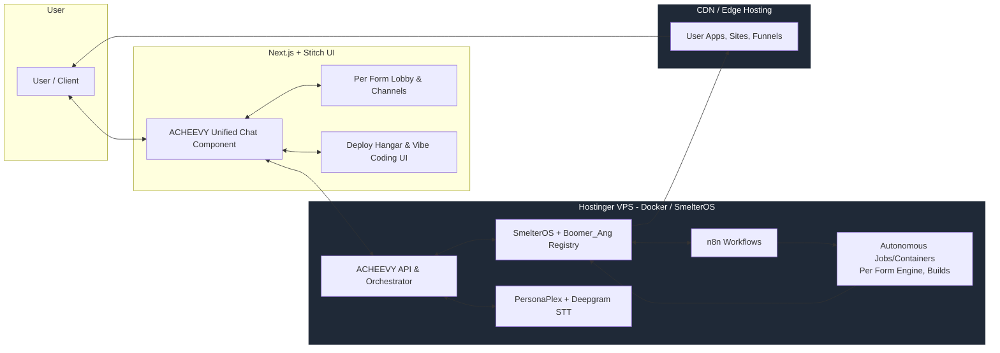

# PRD: A.I.M.S. Voice-First Autonomous Platform

## 1. Overview
- Engagement ID: AIMS-ENG-[DATE]-[XXX]
- Owner: Jarrett / A.I.M.S.
- Complexity Score: [65–100]
- Classification: [Standard | Security-Critical | Compliance-Required]

### 1.1 Project Flow Diagram (Mermaid)

---

## 2. Problem Statement

Build a unified, voice-first, autonomous platform where ACHEEVY is the single entry point for users to:
- Speak to the system (PersonaPlex-like experience).
- Launch autonomous build jobs (apps, PDFs, sites, Per Form analytics).
- Monitor progress and interject.
- Receive BAMARAM completion signals.
- Deploy results to CDN, or VPS-backed services.

---

## 3. Success Criteria

- [ ] Single ACHEEVY UI embedded across all products.
- [ ] Voice I/O with auto-play responses and low latency.
- [ ] Autonomous IDE / vibe coding experience.
- [ ] Per Form platform runs autonomously with fresh content daily.
- [ ] Clear, non-conflicting pipeline: VPS vs CDN.
- [ ] BAMARAM completion and deployment pipeline for all job types.
- [ ] “Completion audit” command that checks all requirements.

---

## 4. Scope

### In Scope

- ACHEEVY unified chat UI (web).
- PersonaPlex + Deepgram integration.
- OpenRouter LLM routing.
- Per Form autonomous lobby and channels.
- Deploy hangar for Boomer_Ang and Lil Hawk spawning.
- VPS container job templates for autonomy.
- CDN deployment for generated apps/sites.
- Governance/audit flows (FDH + gates).

### Out of Scope

- Native mobile apps (for now).
- Non-A.I.M.S. white-label platforms.

---

## 5. Functional Requirements

| ID   | Requirement                                              | Priority | Verification          |
|------|----------------------------------------------------------|----------|-----------------------|
| FR-1 | Single ACHEEVY chat component used across all screens    | P0       | UI inspection, tests  |
| FR-2 | Voice-first conversation with auto-play responses        | P0       | Manual, UX tests      |
| FR-3 | Autonomous job triggering (manual + scheduled)           | P0       | E2E tests             |
| FR-4 | Live Job Monitor (progress + interject)                  | P1       | UI behavior           |
| FR-5 | Per Form autonomous content pipeline                     | P1       | Daily content check   |
| FR-6 | BAMARAM notifications on job completion                  | P1       | Job logs              |
| FR-7 | Deployment to CDN / VPS as per rules                     | P0       | Deployment logs       |
| FR-8 | “Completion audit” against AIMS_REQUIREMENTS             | P1       | Governance run        |

---

## 6. Non-Functional Requirements

| ID    | Requirement                | Target                     |
|-------|----------------------------|----------------------------|
| NFR-1 | Latency for voice reply    | < 500ms perceived          |
| NFR-2 | Uptime (core services)     | 99.5%                      |
| NFR-3 | Token cost per job         | <= [X] baseline            |
| NFR-4 | Security                   | Tenant isolation, HTTPS    |
| NFR-5 | Observability              | Logs + metrics per job     |

---

## 7. Constraints

- Existing Hostinger VPS + Docker stack.  
- Autonomy jobs must run as Docker containers on Hostinger VPS.  
- Next.js + Stitch-based UI.  
- Single ACHEEVY persona + chat UI everywhere.

---

## 8. Deliverables

| Deliverable                          | Format     | Acceptance Criteria                 |
|--------------------------------------|------------|-------------------------------------|
| Unified ACHEEVY chat component       | Code       | Integrated into all key screens     |
| Voice-first pipeline                 | Code/Docs  | PersonaPlex + Deepgram wired        |
| Per Form autonomous engine           | Code/Docs  | Continuous content verified         |
| Deploy hangar UI                     | Code       | Agent cards spawn & visualize       |
| VPS container job templates          | Code       | Cron + manual triggers work         |
| CDN deploy pipeline                  | Code/Docs  | App/site is shareable + paywallable |
| Completion audit command             | Code/Docs  | Reports DONE/PARTIAL/MISSING        |

---

## 9. Estimates

- Token Estimate: [X tokens]  
- Cost Estimate: [$X]  
- Time Estimate: [X runtime hours]  
- Confidence: [X%]

---

## 10. Risks & Mitigations

| Risk                         | Probability | Impact | Mitigation                          |
|------------------------------|-------------|--------|-------------------------------------|
| Voice latency too high       | M           | H      | Optimize buffering, GPU config      |
| Pipeline confusion (VPS/CDN) | H           | H      | Strict deployment rules in SOP      |
| Overwhelming UX              | M           | M      | Use Base44 templates, narrow choices|
| Agent misalignment           | M           | H      | Governance + FDH gates              |

---

## 11. Approvals

- [ ] Owner  
- [ ] Governance (V.I.B.E. gate)  
- [ ] Budget
