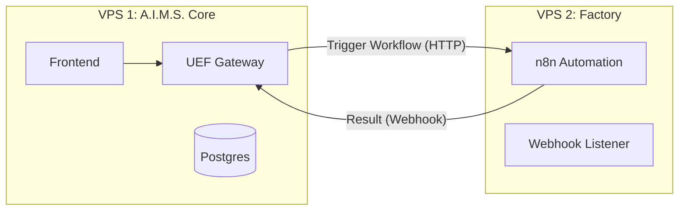

# A.I.M.S. Dual-VPS Infrastructure Strategy

This document outlines the architecture for deploying the **A.I.M.S. Platform** across two separate Virtual Private Servers (VPS). Separating the core orchestrator from the automation engine ensures stability, scalability, and security.

---

## 🏗️ VPS 1: A.I.M.S. Core (The Brain)
**Role**: Orchestration, User Interface, Agent Management, and Reasoning.

### 📦 Services
| Service | Container Name | Port | Description |
|:---|:---|:---|:---|
| **Frontend** | `aims-frontend` | `3000` | Next.js UI (Dashboard, Chat). |
| **UEF Gateway** | `aims-uef-gateway` | `3001` | Main API Gateway & WebSocket Server. |
| **ACHEEVY** | `aims-acheevy` | `3003` | Payment & High-Level Orchestration Agent. |
| **House of Ang** | `aims-house-of-ang` | `3002` | Registry for Boomer_Angs. |
| **Agent Bridge** | `aims-agent-bridge` | `3010` | Security proxy between Core and Agents. |
| **Redis** | `aims-redis` | `6379` | Shared state & caching. |
| **PostgreSQL** | `aims-postgres` | `5432` | Primary Database. |
| **Nginx** | `aims-nginx` | `80/443` | Reverse Proxy & SSL Termination. |

### 🚀 Deployment Command
```bash
# On VPS 1
./deploy.sh --no-cache
# (Ensure n8n profile is NOT active)
```

---

## ⚙️ VPS 2: Automation Engine (The Factory)
**Role**: Heavy Lifting, Workflow Execution, Webhook Handling.
This VPS runs **n8n** and potentially other resource-intensive worker nodes (like a dedicated browserless instance) to prevent the main UI from lagging during heavy processing.

### 📦 Services
| Service | Container Name | Port | Description |
|:---|:---|:---|:---|
| **n8n** | `aims-n8n` | `5678` | Workflow Automation Server. |
| **Tunnel** | `caddy` / `nginx` | `80/443` | SSL setup for n8n webhooks. |

### 🔗 Architecture Diagram


### 🛠️ Configuration Steps

#### 1. Configure VPS 1 (Core)
Update `.env.production` to point to VPS 2:
```env
# Point to external VPS IP/Domain
N8N_URL=https://n8n.your-second-vps-domain.com
N8N_WEBHOOK_URL=https://n8n.your-second-vps-domain.com
```

#### 2. Configure VPS 2 (Factory)
Create a `docker-compose.n8n.yml` (provided below) on the second server.
```env
# .env on VPS 2
N8N_HOST=n8n.your-second-vps-domain.com
N8N_PORT=5678
N8N_PROTOCOL=https
```

---

## 📄 Docker Compose for VPS 2 (n8n Only)

File: `infra/docker-compose.n8n.yml`

```yaml
version: "3.8"
services:
  n8n:
    image: n8nio/n8n:latest
    ports:
      - "5678:5678"
    environment:
      - N8N_BASIC_AUTH_ACTIVE=true
      - N8N_BASIC_AUTH_USER=${N8N_USER}
      - N8N_BASIC_AUTH_PASSWORD=${N8N_PASS}
      - N8N_HOST=${DOMAIN}
      - N8N_PORT=5678
      - N8N_PROTOCOL=https
      - WEBHOOK_URL=https://${DOMAIN}/
    volumes:
      - n8n_data:/home/node/.n8n
    restart: always

  # Simple SSL Proxy for n8n
  caddy:
    image: caddy:latest
    ports:
      - "80:80"
      - "443:443"
    environment:
      - DOMAIN=${DOMAIN}
      - EMAIL=${EMAIL}
    command: >
      caddy reverse-proxy --from https://${DOMAIN} --to http://n8n:5678 --email ${EMAIL}
    depends_on:
      - n8n

volumes:
  n8n_data:
```
