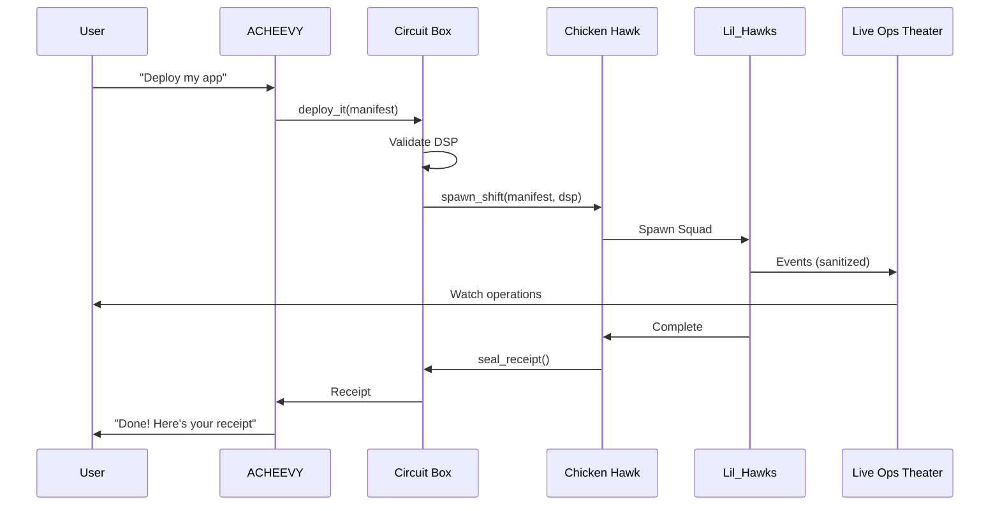

# A.I.M.S. Architectural Overview

## System Map

```mermaid
graph TD
    User((User)) -->|Voice/Chat| Frontend[Next.js 14 Frontend]
    Frontend -->|Chat UI| ACHEEVY[ACHEEVY\nAI Executive Assistant]

    subgraph "Orchestration Layer"
        ACHEEVY -->|Tool Calls| CircuitBox[Circuit Box\nCentral Hub]
        CircuitBox -->|Validate| BoomerAng[Boomer_Ang\nScope Validator]
        BoomerAng -->|DSP Check| DSP[Deploy Security Packet]
    end

    subgraph "Deploy Platform - Boomer_Angs on the Port"
        CircuitBox -->|Contract| Chicken Hawk[Chicken Hawk\nExecution Engine]
        Chicken Hawk -->|Spawn| Squad[Squad]
        Squad -->|Workers| LilHawks[Lil_Hawks\nWorker Bots]
        LilHawks -->|Events| Theater[Live Ops Theater]
    end

    subgraph "Persistence Layer"
        Chicken Hawk -->|Logs| KYB[KYB Flight Recorder]
        Chicken Hawk -->|Receipt| Receipt[Signed Receipt]
    end

    Theater -->|Watch Only| Frontend
    Receipt -->|Verify| ACHEEVY
```

## Governance Chain

```
User → ACHEEVY → Boomer_Ang → Chicken Hawk → Squad → Lil_Hawks → Receipt → ACHEEVY → User
```

| Step | Actor | Action |
|------|-------|--------|
| 1 | ACHEEVY | Approves plan, presents to user |
| 2 | Boomer_Ang | Validates scope against DSP limits |
| 3 | Chicken Hawk | Receives contract with ShiftId |
| 4 | Squad | Coordinates Lil_Hawk workers |
| 5 | Lil_Hawks | Execute tasks, report logs only |
| 6 | ACHEEVY | Verifies receipt, closes with user |

## Core Components

### 1. Frontend (ACHEEVY Chat)

The user-facing Next.js application with:
- **ACHEEVY Chat Interface**: `/dashboard/acheevy` - AI assistant interaction
- **Live Ops Theater**: Watch-only view of Lil_Hawk operations
- **Circuit Box Dashboard**: System monitoring and control

### 2. Circuit Box

Central integration hub connecting ACHEEVY to the Deploy Platform:
- **Tool Router**: Routes ACHEEVY tool calls to Chicken Hawk
- **Validation Gates**: DSP, OEI, quota, certification checks
- **Event Streaming**: Real-time events to Live Ops Theater

### 3. Deploy Platform

"Boomer_Angs on the Port" - containerized execution system:

| Component | Role |
|-----------|------|
| Chicken Hawk | Execution engine, spawns workers |
| Squad | Coordinated group for a Shift |
| Lil_Hawks | Individual worker bots |
| Shift | Unit of work with lifecycle |
| Manifest | Deploy instructions |
| Receipt | Signed audit trail |

### 4. Workforce Hierarchy

```
Hatchling → Apprentice → Journeyman → Foreman → Chicken Hawk_Candidate → Chicken Hawk
```

Each level has:
- **Certifications**: Y-ISO standards compliance
- **Permissions**: Graduated access to capabilities
- **Mentorship**: Higher levels guide lower

### 5. UEF Gateway

The backend orchestration layer handling:
- **ACP** (Agentic Communication Protocol)
- **UCP** (Universal Commerce Protocol)
- **LUC** (Live Usage Calculator)
- **DSP** (Deploy Security Packet)

## Deploy Platform Vocabulary

| Term | Meaning |
|------|---------|
| Deploy It | Fast lane - pre-approved, low OEI |
| Guide Me | Consultative lane - needs approval |
| Manifest | What to deploy + how |
| Crew | Lil_Hawks on a Shift |
| Shift | Clock-in to clock-out work unit |
| Receipt | Signed proof of completion |

## Capability Registry

| Category | Capabilities |
|----------|-------------|
| Crane Ops | Heavy infra (containers, DBs) |
| Load Ops | File transfer, config updates |
| Deploy Ops | Build, package, release |
| Safety Ops | Scans, anomaly detection |
| Yard Ops | Routing, load balancing |
| Dispatch Ops | Orchestration, scheduling |
| Invisible Ops | Observability, logging |

## Security Model

### Deploy Security Packet (DSP)

Every Shift requires an approved DSP with:
- Identity & access rules
- Network allowlists
- Secrets scope
- Supply chain attestation
- Runtime hardening
- Detection & response
- Audit evidence

### Y-ISO Standards

Internal quality framework:
- **Y-ISO-01**: Manifest Integrity
- **Y-ISO-02**: Environment Isolation
- **Y-ISO-03**: Secrets Hygiene
- **Y-ISO-04**: Observability
- **Y-ISO-05**: Rollback Readiness
- **Y-ISO-06**: Human Escalation
- **Y-ISO-07**: Continuous Certification

## Event Flow



## File Structure

```
infra/deploy-platform/
├── circuit-box/
│   ├── acheevy-tools.json      # ACHEEVY tool definitions
│   ├── chicken-hawk-dispatch.json  # Chicken Hawk API
│   └── circuit-box-config.json     # Hub configuration
├── lore/
│   ├── workforce-structure.json    # Career levels
│   ├── y-iso-standards.json        # Quality standards
│   ├── lil-hawk-designations.json  # Worker types
│   ├── live-ops-theater.json       # Theater config
│   └── evolution-bounds.json       # Safe tuning limits
├── contracts/
│   ├── shift-contract-schema.json  # Shift contract
│   └── deploy-security-packet.json # DSP schema
└── registry/
    ├── capability-registry.json    # Available capabilities
    └── bot-moniker-rules.json      # Naming conventions
```
